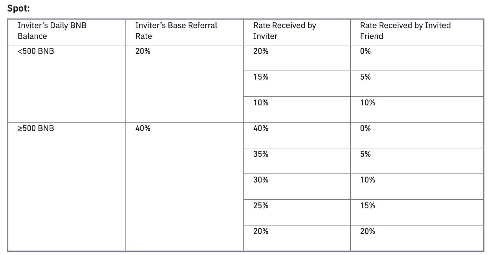
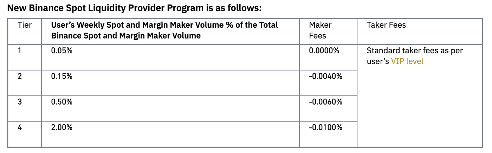

# HFT Strategy and Backtesting

Before diving deeply into this post. I would suggest you to read the basics of high frequency trading (HFT) first: https://medium.com/@quantland/high-frequency-trading-803912b0d272

# Strategy

Making the best of anything requires a very good strategy. The same is true for HFT. I roughly classify the strategies into taker and maker, and analyze the pros and cons between them.

## Maker

Maker strategies post limit orders on an order book which will not be filled immediately, providing liquidity and depth. Nevertheless, they are not able to fully utilize alpha which can predict the price trend. This kind of strategy profits from the difference between bid-ask spreads.

## Taker

Taker strategies utilize alpha to predict expected returns and take everything from an order book if it is profitable. In comparison to maker strategies, taker strategies are unlikely to be compensated for inventory risks. An additional cost for taker strategies is transaction fees. Some more detailed costs that needed to be covered will be discussed in the following section.

# Details of HFT costs

In the previous article, we discussed about the taker fee rates for VIP 0 and VIP 9, now we dive into the details.

## Referral program

Let’s take the spot market at Binance for example. Before creating an account, you can set a referral code to get the best discount fee rate for your account. If you can find an inviter with a daily BNB balance over 500 and a base referral rate over 40%, your trading fee will get a 40% discount, which is very critical for HFT. Different exchanges have different referral programs. Making sure every detailed is correct is the key to make your trades more efficient.

Binance referral, source: https://www.binance.com/en/support/faq/cbac15853b0243cda4a90c9c03ca0c38

## Designated Market Maker (DMM)

Much more discounts can be obtained by higher-level investors. A designated market maker is one that has been selected by an exchange as the primary market maker. Again, take the spot market at Binance for example, the best maker fee rate for a market maker can be as low as -0.01% , which is very critical for HFT.

Binance liquidity provider, source: https://www.binance.com/en/support/announcement/0a24d83ea978466a9525c603e89368ce

# Backtesting

For any kind of traded assets, backtesting is necessary (as history may repeat itself). The theory is that strategies that work in past are more likely to work again in the future.

## Simulated broker

Making simulated results as close to live trading as possible is the most important thing in backtesting.

## Details to consider — latency

For HFT, we need to monitor latencies for different exchanges. We need to make latencies for simulated brokers as close to live trading latencies as possible. Failure to do so will overestimate or underestimate backtesting results.

## Details to consider — fill model

For maker strategies, limit orders placed on order books may influence market trends. Without dark pool data, we are not entirely sure the filled rates of our orders. To solve this problem, maker strategies need to be run live first. By collecting the log from live trading, you may make the backtesting closer to live trading when you train a fill model.

## Details to consider — disconnection

Disconnection may happen from time to time due to several problems. They could be problems with our own network or with an exchange disconnection. For Long-term trading strategies, disconnection may not be a critical problem. Yet, for HFT they do. A disconnection test is necessary before a strategy can go live.

# Hypertuning

Before going live, parameters require precise adjustments. Selecting a stable range for your parameters is the key for choosing the best parameter. I recommend using HiPlot for hypertuning. It is a clear and useful tool.

HiPlot, source: https://facebookresearch.github.io/hiplot/

# **Summary**

From my point of view, it is nearly impossible for a retail investor to do HFT. HFT is a huge project. To be successful, every aspect of HFT must be the best, including trade systems, backtest systems, and alpha researches, etc. Additionally, transaction fees are another concern. The VIP 9 fee rate is a must for HFT, which is really hard for a retail investor to obtain.

- https://medium.com/@quantland/hft-strategy-and-backtesting-4266d5c41cd9