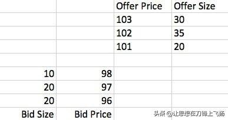
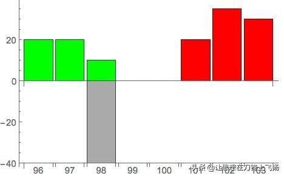
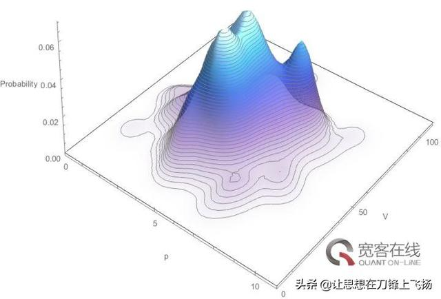
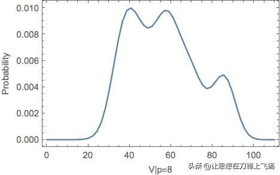

# 什麼叫做Order Book

現在主流的交易所一般都使用Order Book進行交易，交易所在內部的Order Book上記錄所有買家和賣家的報價，比如像這樣：

Bid表示買家，Offer表示賣家，這張報價單表示買賣雙方發出的所有報價單（Limit Order）。這張表才是高頻交易最關心的信息。任意時刻，買家的出價總是低於賣家（比如這裡的98對101）。所以報價雖然一直在變化，但是隻有報價是不會有任何成交的。

什麼時候會產生交易呢？有兩種情況，第一是任一方發出市價單（Market Order），比如一個買家發出一張單量為10的市價單，就可以買到賣方在101價格上掛的10份，這個交易成功之後，Order Book會變成這樣：

第二是發出一個價格等於對方最優報價的限價單，也會產生和上述情況相同的結果。

需要強調的是，雖然真正的Order  Book只存在於交易所內部，所有交易都在交易所內完成，但是交易所會把每筆報價和市價單都轉發給所有人，所以所有的買家和賣家都可以自己維護一個同樣的數據結構，相當於交易所Order Book的鏡像。**通過跟蹤分析自己手裡這份的鏡像變化，來制定交易策略，是高頻交易算法的核心思想。**

基礎知識介紹完畢，下面為了方便大家理解，我採用一種更形象的方式來表示Order Book：

這張圖對應文章開始時的那個Order Book，應該可以明白地看出，橫軸表示價格，縱軸表示訂單量，綠色表示買家，紅四表示賣家。這樣做的目的是為了引出本篇討論的主題：冰山訂單。

通過上述基本分析大家可以看出，交易所內的交易數據是完全公開的，市場上任意時刻，有誰想要買／賣多少，所有人一目瞭然，沒有任何秘密。這樣做本身是有經濟學意義的，因為只有展示出買賣的需求，才會吸引潛在的商家來交易，所以**在市場上一定程度的公開自己的需求是必要的**。但這樣同時帶來一個嚴重的後果，一旦有某個人想要大量買／賣，他所發出的巨額限價單會直接展示給所有人。比如一個買家掛出巨額買單後，Order Book會像這樣：

這對他非常不利，因為所有人都會利用這個信息來跟他做對。大家會判斷，現在市場上存在大量的買壓，於是會出現一大批為了賺錢而衝進來的人搶購，價格會快速上升，這樣原來這個人可以在98這個價位買到的東西，很快就變得要在更高的價位上才能買到。這種情況，那些後來的人做的就是Front running，而原來的那個人則面對逆向選擇風險。

為瞭解決這個問題，交易所提供了一種針對性的工具，就是所謂的冰山訂單（Iceberg Order）。這種訂單可以很大，但只有一小部分是公開出來的，大部分則隱藏起來，除了交易所和發單者本人誰也看不到，真的像一座「冰山」一樣。比如像這樣：

灰色的部分就是冰山訂單隱藏的部分。這樣，只有當有對應隱藏量的交易發生時，交易所才會通知其他人，就避免了別人利用顯示訂單的信息來做Front running。

凡事有一利必有一弊。冰山訂單雖然保護了發單者的利益，但是對於其他市場參與者來說卻又變成了一種不公平的規則。那些有真實的交易需求的參與者，會因為對局勢的誤判而損失慘重。所以接下來的問題就變成，如何發現市場上的冰山訂單？

首先有一種最簡單的方法。有的時候，冰山訂單是掛在最優買價和賣價之間（spread），像這樣：

對於這種情況，有一個非常簡單的探測方法，即發一個最小額度的限價單在spread裡，緊跟著取消這個訂單。比如這個例子中，發出一個賣價為99的限價單然後取消。因為這個價格本身對不上顯式的買價（98），如果沒有冰山單的存在，一定不會成交。但有冰山單的情況下，一旦交易所收到這個賣單，會立刻成交冰山單中對應的量，而之後的取消指令就無效了。這樣，以一種微小的成本，就可以發現市場中隱藏著的訂單。事實上，的確有人會做這種事情，頻繁的發單然後取消，在最優價差之間形成一種高頻擾動，用來探測隱藏單。

為了應對這種擾動探測，大家一般都不會直接掛單在spread裡。而是會像之前那樣和普通的限價單掛在一起，這樣發生交易之後，你就很難推測消耗掉的究竟是正常的限價單，還是冰山訂單。那麼應該怎麼做呢？

首先有一個直接的思路。冰山訂單的存在，一定程度上反映了掛單人對市場情況的解讀，認為有必要使用冰山訂單而做出的判斷。需要強調的是，使用冰山訂單並不是沒有代價的，因為你隱藏了真實的需求，在屏蔽掉潛在的攻擊者的同時，也屏蔽掉了真正的交易者！而且會使得成交時間顯著增加－－因為沒人知道你想買／賣這麼多，你只能慢慢等待對手盤的出現。所以當有人下決定發出冰山訂單的時候，也會有對市場情況的考慮，只有合適的時機才會做這種選擇。

什麼是合適的時機？有一些數據應該是相關的，比如買賣價差spread，買單量對賣單量的比值等。對這些數據，你可以在歷史數據上做回歸分析，建立起他們和冰山訂單之間的線性／非線性模型。通過歷史數據訓練出來的這個模型，就可以作為你在實時交易時使用的冰山訂單探測器。這是 On the Dark Side of the Market: Identifying and Analyzing Hidden Order Placements 這篇論文使用的方法。

基本模型可以定義為：F(spread，bidSize/offerSize，……) = Probability(Iceberg)

如果你想玩高深的，還可以在此基礎上做HMM，SVM，神經網絡之類的高級模型，但基本思路是一致的：通過盤口分析計算存在冰山訂單的概率。

上面說的這個方法，看起來很高級，實際效果如何呢？我想大家也看出來了，這種建模不是很精確。作為事後分析手段用來說明什麼情況下可能會出現冰山訂單還不錯，但是作為實時交易的探測器就不是很放心。因為使用的信息太模糊了，而且說到底建模的對象只是一種相關性，沒有什麼保證冰山訂單的發送者一定是按照這個邏輯出牌的。

所以接下來介紹的，才是真正具有高頻玩家神采的方法，來自 Prediction of Hidden Liquidity in the Limit Order Book of GLOBEX Futures 這篇論文。

高頻世界裡，有一條永恆的建模準則值得銘記：先看數據再建模。如果你看了上面的介紹就開始天馬行空的思考數學模型，那基本上是死路一條。我見過很多年輕人，特別有熱情，一上來就開始做數學定義，然後推導偏微分方程，數學公式寫滿一摞紙，最後一接觸數據才發現模型根本行不通，這是非常遺憾的。

而看了數據的人會怎麼樣呢？他很可能會發現，對於冰山訂單的處理，交易所的規則是非常值得尋味的。有的交易所是這樣做的：一個冰山訂單包含兩個參數，V表示訂單總量，p表示公開顯示的量。比如V=100，p=10的冰山單，實際上隱藏的量是90。如果有針對這個訂單的交易發生，比如交易量10，交易所會順序發出三條信息：

1. 成交10
2. Order Book的Top bid size -10
3. 新Bid +10

這三條信息一定會連續出現，並且第三條和第一條的時差dt很小。這樣做的原因是儘管冰山訂單存在隱藏量，但是每次的交易只能對顯示出的量（p）發生，p被消耗掉以後，才會從剩餘的隱藏量中翻新出一分新的p量。這樣，每個人從交易所收到的信息仍然可以在邏輯上正確的更新Order Book，就好像冰山訂單並不存在一樣。

因此，一旦在數據中觀察到這個規律，我們就可以非常有把握的判定市場中存在冰山訂單，並且連p的值都可以確定！接下來的關鍵問題是，如何確定V的值，即判斷這個冰山訂單的剩餘存量有多少？

這個問題從本質上說沒法精確求解，因為V和p都是由下單人自己決定的，可以是任意值。但可以從兩點考慮：第一，兩個值都是整數；第二，人類不是完美的隨機數生成器，下決定會遵循一定規律。

從這兩點出發，可以對V和p建立概率模型，即計算一個給定的（V，p）值組合出現的概率是多少？這裡不去深入探討數學分析，感興趣的朋友可以自己去看原文。簡單說，可以在歷史數據上通過kernel estimation技術來估算他們的概率密度函數的形狀。順帶一提，如果你親手編寫過這種估算程序，就會理解我為什麼在「要想成為一名優秀的  Quant 需要什麼樣的編程水平？」這個答案中如此強調編程的重要性。在數據上估算出來的概率密度函數可能會是這樣的：

這樣，當你在實時數據中觀測到一個p的值時，就可以得出對應的V值的條件概率密度函數，即上圖的一個切面，比如（p = 8）：

接下來顯然就很容易計算V最可能是什麼值了。這條函數曲線還有一個重要的作用是幫助你動態評估剩餘存量，比如當你觀察到已經有5份p被消耗掉，即可推出V>=40，由上圖即可推出新的V值和剩餘存量（V-5p）。

綜上，算法的核心在於，通過在實時數據中監測短時間內連續出現的三條相關記錄判斷冰山訂單的存在，而對冰山訂單的量化則通過由歷史數據訓練出的概率模型來完成。

相信你也會看出，這種算法並不是什麼作弊神器。它只是利用市場上的公開數據所做的一種推測。而且這個推測也僅僅是基於概率的，更多的應該是作為一種參考。它對做市商這種流動性提供者很有意義，可以使他們避免因為對局勢的誤判而遭受損失。但如果你想用它來作為一種攻擊手段，覺得自己能發現隱藏大單而去Front run，那實在是很不明智的選擇。

最後，這種算法也只是針對特定的交易所。其他的交易所也許不會採用同樣的冰山訂單處理方式。所以真正有價值的是這種從實際數據出發的建模思路，具體的算法並不值錢。

這個小算法給你展示了高頻交易領域的「冰山一角」。它看起來也許不算很複雜，但是我卻很喜歡。因為它清晰地展示了什麼叫做先有思路，再有量化。因為有「冰山訂單」這樣一個從經濟學基本的供需關係出發的真實需求，通過分析實際數據找到一絲線索，最後通過數學模型刻畫出定量的策略，這才是漂亮的策略研發。

如果違背這個原則，一上來就去搬各種高級的模型去套數據，指望模型自動給你生成交易信號，這在我看來無異於痴人說夢。遺憾的是，這個夢的確太過誘人，而這個世界也從來不缺少莽夫。

## 參考

- https://kknews.cc/zh-tw/news/42e2bl3.html