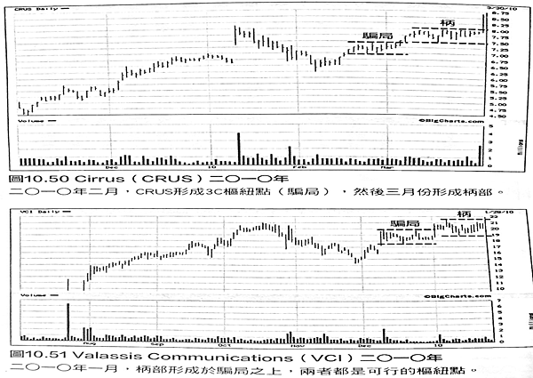
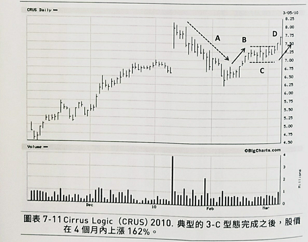
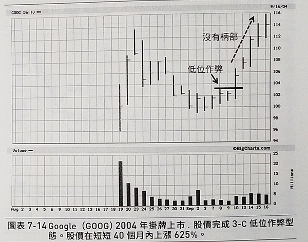
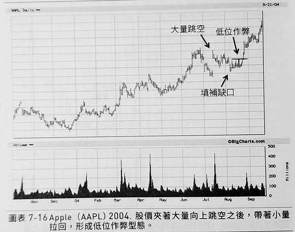
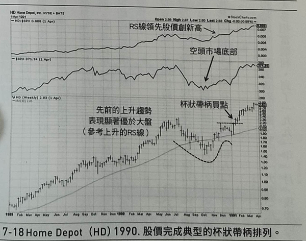
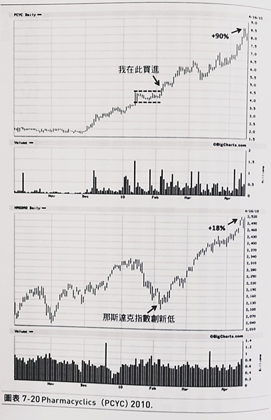

## 3C與其他有用型態

## **3-C型態**

　　杯狀完成作弊型態(cup completion cheat)或3-C型態屬於連續排列。**這種排列之所以稱為「作弊」，是因為我過去認為這屬於早期階段的進場時機，時間點較最佳買點來得更早，所以用「作弊」來形容相當貼切。**至於現在，我認為這是交易者想要買進任何股票的最早買點。**相較於先前的「杯狀」排列，「作弊」買點可能出現在杯狀中間三分之一、或是下端三分之一的位置**，關鍵是要辨識股票打底完成而展開新的主要第二階段上升趨勢。作弊交易是讓我們有機會找到可供採取行動的樞紐點，在相對偏高的勝算條件下，掌握股價向上反轉的時機。

　　**有效的作弊型態應該呈現成交量萎縮以及價格波動減少**，而這個暫停走勢提供了交易者一個最早的進場時機。儘管此處未必是你以往的進場位置，但是我們可以透過作弊區域來降低平均進場成本。一旦股價越過暫停區域或樞紐點的高點，股票即可被視為向上反轉；這表明了該股票已經由低點回升，並恢復為第二階段的長期主要趨勢。

　　作弊架構與傳統的杯狀帶柄排列(cup with handle)類似，因為前者只代表杯狀部份完成。柄部的位置通常是在杯狀的上方三分之一位置。**柄部如果發生在中間三分之一位置或中間稍下方，交易者可以多一個或以上的進場點。**關於這種排列的先決條件，股票在過去三～三十六個月期間內，至少必須已經上漲二五～一OO%，甚至二OO%或三OO%的漲幅。股價也必須位在向上發展的二OO天移動平均上方(前提是該股票已經上市掛牌超過二OO天)。這個排列的涵蓋期間可以介於三週到四十五週之間(大多介於七～二十五週之間)。向下修正幅度由峰位到谷底為一五~二Ｏ%，某些情況可能到達三五~四○%或甚至五○%，這有一部份取決於當時的大盤市況。修正幅度如果超過六Ｏ%恐怕就不合理，排列相對容易失敗。作弊型態通常都發生在大盤向下修正的期間，或是出現於大盤修正完成向上回升的位置，起碼兩者的時間相當接近(請參考圖表 7-10)。這種型態下發展的股票，將最具有潛力。

[013_3C_1]

[021_3C_7_10]

 

## **「作弊」的解釋**

　　股價由作弊區域上升，應該出現下列四個階段( 請參考圖表 7-11～7-13）

　　 1. 下降趨勢。股票會經歷一段 中期價格修正，發生在較長 期第二階段上升趨勢過程。 這隻向下延伸的腳，可能涵蓋數週或數個月期間。這是股價大漲之後正常的向下修正，下跌過程的成交量增加。

　　2.上升趨勢。價格試圖從前述下降趨勢向上回升。這時候還不適合買進，進場還言之過早，因為價格和成交量都還沒有確認股價見底而邁入新的上升趨勢。等到價格開始回升，通常會反彈到先前跌幅的三分之一或二分之一位置。可是，先前中期回檔過程在上檔會留下不少賣壓，因此反彈走勢不免會遭遇阻力，導致走勢停頓或回檔。

　　3.停頓。股價走勢停頓數天或數個星期，形成橫向狹幅盤整區域(作弊)，高低價差不超過五～一Ｏ%。最理想的情況下，**作弊整理得以向下修正，跌破先前的低點，產生洗盤的效應**，這也是我們希望看到杯狀帶柄型態的柄部排列發展。這個時候，股票架構即將完成，只待價格向上突破停頓盤整的高點。突破的典型徵兆，是成交量極度萎縮，價格波動縮小。

　　4.突破。股價向上突破停頓橫向盤整區域的高點，此時將引發設定在該處的買單。這個時候，股票已被視為向上反轉，也就是說股價已經由低點回升，中期趨勢向上發展，繼續往長期的第二階段主要上升趨勢進行。

[014_3C_7_11]

[019_3C_7_12]

[017_3C_7_13]

## **「低位作弊」**

「低位作弊」是指作弊排列發生在杯狀底部的最下端三分之一位置。對於典型的3-C型態，作弊排列應該發生在杯狀底部中間三分之一位置；作弊排列如果發生在杯狀底部上方三分之一，則屬於「杯狀帶柄」排列。**相形之下，「低位作弊」排列的風險較高，但獲利潛能也較大，因為進場點通常更低。如同前述，我經常會根據低位作弊型態進場，然後在較高的樞紐點陸續加碼。透過這種方式分批進場，可以降低進場成本。** 

　　我喜歡運用低位作弊排列操作大型股，或某些最近上市的新股。如果要運用低位作弊於新上市股票，股價不能顯著跌破上市承銷價格。最好的情況下，股價應該始終保持在承銷價格之上。某些案例，價格可以短暫跌破承銷價格，製造洗盤的效果。底部完成時間至少必須距離上市日期十天或 以上。如同任何打底排列一樣，我們不希望看到上檔有太多套牢籌碼。 舉例來說，谷歌在二〇〇四年八月 掛牌上市。經過短暫上漲之後，股價進行為期十四天的修正，形成低位作弊型態。如同圖表 7-14 所顯示的，低位作弊買點呈現的徵兆，就如同其他 3-C型態：價格狹幅波動，成交量萎縮。我還希望看到其他類似意義的徵兆——供給籌碼幾近於消失，形成最小阻力路徑———譬如成交量顯著縮小的內側日 (inside days)

[018_3C_7_14]

　　二〇一三年十二月，推特(Twitter) 呈現一個幾乎和谷歌十年前完全相同的 排列(請參考圖表 7-15)。推特的這個底部排列，涵蓋期間為十九天。推特完成底部排列之後的漲幅，雖然不能和谷歌相提並論，但這個低位作弊仍然代表很棒的交易機會；股價在十六天之內上漲了七七%。 

　　蘋果電腦提供另一個案例，其股 價在二〇〇四年八月形成低位作弊型態(請參考圖表 7-16)。股價先是夾著巨量向上跳空，然後拉回填補缺口，成交量稍微縮小。低位作弊的樞紐點，屬於低風險進場價位。股價如果繼續下跌，顯然意味著測試失敗，因此有了相當明確的出場點。 

[016_3C_7_15]

[015_3C_7_16]

## **夢幻型態**

　　一九六Ｏ年代，威廉·吉勒(William L. Jiler)出版的《股價走勢圖精論》(How Charts Can Help You in the Stock Market， 中文版，二〇〇四年，寰宇出版)，其内容可以說是領先當時的時代，甚至到了今天，仍然是 一部珍貴的參考資料。我認為，凡是對於股價圖型分析有興趣的研究人士，這本書都是必讀的經典。吉勒是最初強調碟狀帶柄型態的人，這種型態後來被稱為杯狀帶柄。毫無疑問，這是經常看到的可靠價格排列，很多超級績效潛力股就是運用這種型態展開積極價格走勢。 

　　吉勒稱呼這種碟狀排列為「夢幻型態」，主要是強調其易於辨識，而且相當可靠。我雖然同 意吉勒的看法，**但這種型態也經常被誤解；然而，如果採用 VCP 概念，再搭配成交量資訊的判讀，可以釐清某些不必要的誤解，更容易鎖定超級績效潛力股**。如同前文強調的，價格波動 收縮是許多底部型態的共同特徵，包括這種型態在內。 

　　一九九Ｏ年，油價飆漲，美國即將進攻伊拉克，股市呈現出嚴重的空頭市場。幾乎所有投 資人都認為，股票市場將繼續下跌。可是，我發現到很多股票呈現大型的 3-C 排列或杯狀帶柄 排列，其中很多屬於低位作弊型態，股價稍微上漲之後，又形成柄部排列。當時，雖然多數大盤指數都位在二〇〇天移動平均之下，但前述那些股票卻多數位在二〇〇天和五〇天移動平均之上，RS 排序則大多位在九十五或之上。 

　　相當幸運地，我的紀律凌駕了我的情緒。根據股價走勢圖資料判斷，我在一九九〇年十月 開始買進股票，而且此時所進行的交易，發展大多相當順利。到了一九九一年一月，我加快了買進步調。相當巧合地，就在我買進幾家底部排列結構完善的股票之後，《投資人經濟日報》發表了一篇評論，標題是「杯狀帶柄排列現象蔓延」(Cup with Handles Proliferate)，並且刊登 了某些成型或即將完成杯狀帶柄排列的股價走勢圖。接下來的發展，都屬於歷史了。一九九一 年一月開始，美國股票市場展開有史以來最顯著的多頭行情之一(發動日期剛好對應著美國開始攻擊伊拉克)。我相信股價走勢圖呈現的訊息，而不是自身的情緒，我手頭上持有好幾家表現最佳的市場領導股，它們創造了傳奇性的報酬績效。這些股票之中，許多都成為家喻戶曉的大型企業，譬如微軟、安進、家得寶、戴爾電腦、思科系統，以及其他企業等(請參考圖表 7-17 與 7-18 )。**在當時，知道這些企業的人還不多，它們大多屬於默默無聞的小企業。** 

[022_3C_7_17]

[023_3C_7_18]

## **雙重底型態**

　　雙重底(double bottom)結構形成W狀的底部，其中第二個低點位置跌破第一個低點(有些排列的兩個低點位置大致相當)。**我偏好第二個低點較低的雙重底**，因為這可以產生洗盤的效果，有助於清洗浮額。**我也希望看到雙重底排列的右側，形成停頓狀的狹幅橫向盤整或樞紐點，就如同我所交易的所有底部排列**。如同前文討論的其他排列，雙重底也可以呈現作弊區域或柄狀結構。**雙重底排列如果沒有出現作弊或柄狀結構，價格直接向上突破，往往更容易失敗**。 

　　這種型態也可能出現在股票剛掛牌之後不久，形成主要底部，或第二階段底部(請參考圖表 7-19)；二〇〇三年四月，迪克運動器材掛牌上市之後不久，形 成雙重底排列，大盤也同時形成底 部。 

[024_3C_7_19]

## **強勁攻勢**

　　此處想要討論的最後一種型態，是所謂的強勁攻勢(power play)，也稱為高聳旗形(high tight flag)。這是最重要、獲利最豐碩的排列之一，但也是最經常被誤解的技術型態。然而， 如果你得以正確辨識，這也是 獲利潛能最高的價格型態。我稱呼這種強勁攻勢為加速型態，理由有二：第一，強勁攻勢的走勢，必須蘊含著強大動能；事實上，這種型態的第一個條件，就是先前必須出現一波急遽的大漲走勢。第二，這種排列完成之後，可能在最短時間内，爆發最大的走勢，經常意味 著相關公司的營運展望出現重大變化。這類行情發生的誘因，可能是公司某項重大新聞：譬如 FDA 核准新藥，或是訴訟案件取得和解，某企業推出新產品或新服務，甚至是盈餘報告告捷。不過，這類形態也有可能出現在無明確誘因之時；換言之，沒有基本面或消息面因素的配合，完全屬於技術層面的型態。所以，我也可能在沒有基本面理由的情況下，根據這種價格型態進場建立部位。請注意，這並不代表這種價格型態全然沒有基本面因素配合；事實上，通常會有盈餘或銷貨方面的基本面消息，只是不足以解釋型態爆發的力量。 

　　**對於這種強勁攻勢，我雖然不要求有基本面因素配合，但必須如同所有架構一樣，出現類似 VCP 的性質。**即便是強勁攻勢，供給與需求之間同樣要有適當的消化、整理。**關於這種型態，交易者應該留意週線收盤價相當緊密的三～六週橫向整理。 強勁攻勢型態必須具備下列條件：**

 　● 價格爆發一波夾著巨量的重大漲勢，股價漲幅在八週之內至少為一ＯＯ%。可是，這波漲勢如果發生在上升趨勢最末階段，則不符合條件。最好的強勁攻勢，往往發生在原本平靜的第一階段末期，突然夾著大量爆出重大漲勢。 

　　●急遽漲勢告一段落之後，股價展開橫向狹幅整理，修正幅度不要超過二〇%(某些小型股的修正幅度可能高達二五%)，涵蓋期間大概三～六個星期(有些整理只需要十或十二天)。 

　　●如果向下修正展開數波段底部整理，高點到低點之間的幅度不要超過一〇%，但不必出現價格波動持續收縮的現象，因為盤整的幅度已經夠小。 

　　二〇一〇年二月四日，那斯達克指數創新低，我在當天買進 Pharmacyclics (PCYC)， 同時也將其列為我們公司客戶的推薦股(請參考圖表 7-20)。隨後四十八個交易日內， Pharmacyclics 股價上漲九〇%，那斯達克指數的同期漲幅為一八%。這波九○%漲幅只是開始而已，該股票在隨後四十三個月內上漲二六〇〇%，呈現明顯的市場領導股走勢。 

　　要知道該買進哪支股票，以及買進的時間與價位，都需要預先準備好周全的計畫，完全不 受情緒干擾。很幸運地，交易決策可以遵循準則與規定。想要學習如何辨識最佳潛力股與最佳買點，雖然需要花費相當多的時間，以及秉持最嚴格的紀律，但交易者只要願意認真學習，運用正確的準則，拿捏適當的買點，就可以邁向成功的道路。

