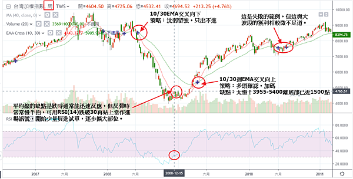
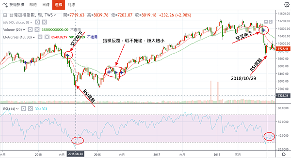
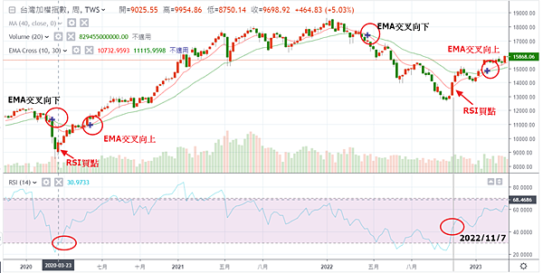
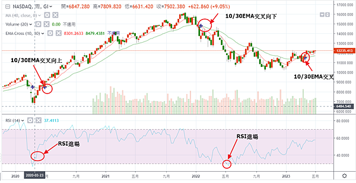
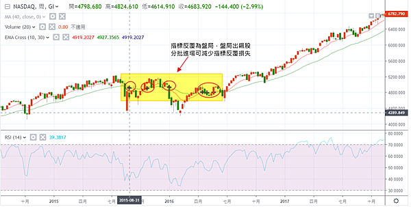
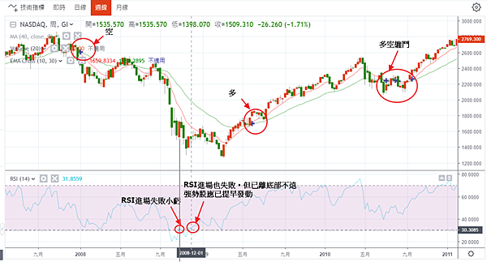
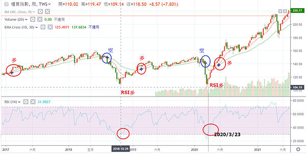
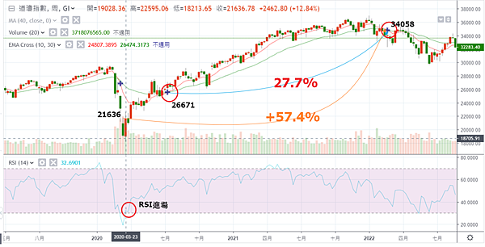

## EMA1030交叉法

就像傳奇投資人班傑明．葛拉漢說的：「實現令人滿足的投資成果比多數人理解的更容易；但要實現卓越的成果，卻比表面上看起來難得多。」你要打敗80%的投資人，很簡單，買ETF就好了。

　　但就像我之前討論的，超級績效與平均績效的差異十萬八千里。要想比平均績效更進一步，只要用一個方法就可以了，就是：10/30週EMA交叉向上做多，交叉向下看空。再作一點改進如下圖，大概就可以贏過90%的投資人。

　　注意：宏觀多空愚痴妄，唯有一線透天機。預設立場而不尊重市場的人，即使曾為大師，到最後也難逃覆完命運。

## **規則**

規則一：交叉向下

10/30週EMA交叉向下，開始汰弱留強，只出不進。

規則二：交叉向上

10/30週EMA交叉向上，多頭確認，可加大部位。

規則三：RSI買進輔助原則

當交叉向下時均線通常能靈敏反應跌勢(因為多頭力竭通常已經掙扎一段時間均線已收斂)，而交叉向上時均線反應較慢，比如已經離低點千點以上。此時可用其他指標輔助，即：**當RSI(14)跌破30再度站上時，開始進場，少量試單，有賺錢則逐步擴大部位**。

規則四：作空才作指數

因指數空間有限，建議加碼不要超過2次(即三刀流)，作多時也儘量操作個股，作空時因個股放空先天不利，這時才作指數，罔賺一點。

## **範例**

### **臺股2008**

### **臺股2015**

### **臺股2020**

### **NAS2008**

 

 

### **NAS2015**

失敗範例

### **NAS2020**

### **臺灣櫃買2018**

### **DOW2018**

下圖顯示，加入RSI進場點，績效增加一倍。

