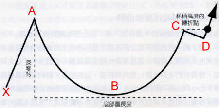
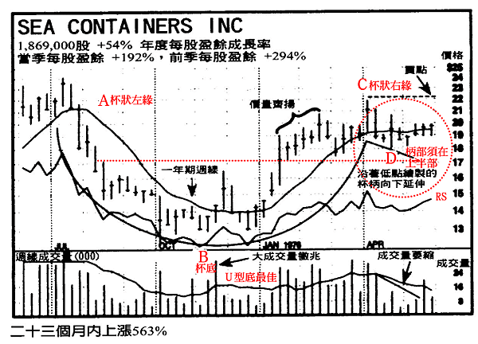
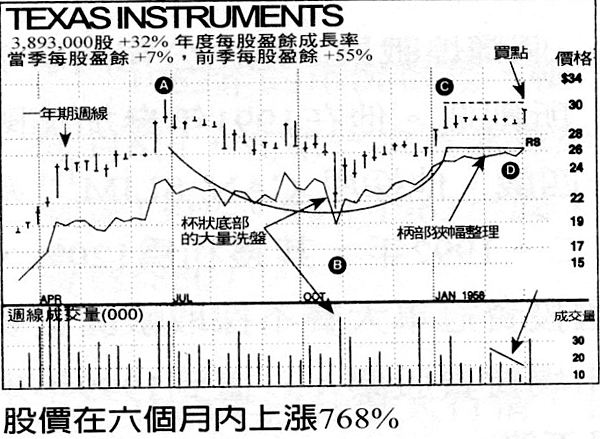
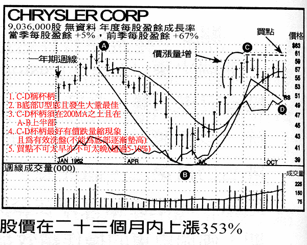
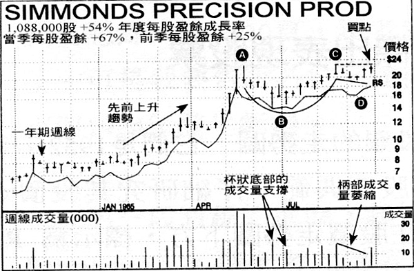
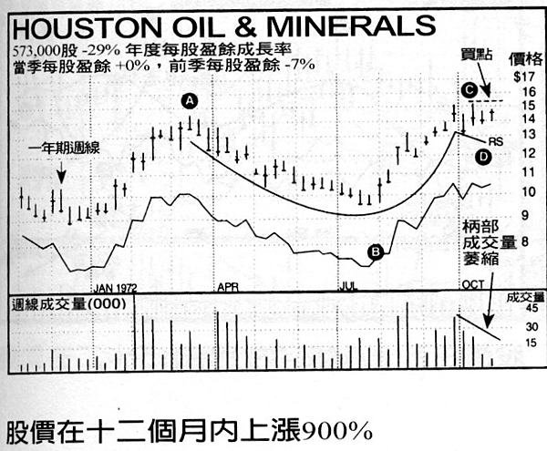
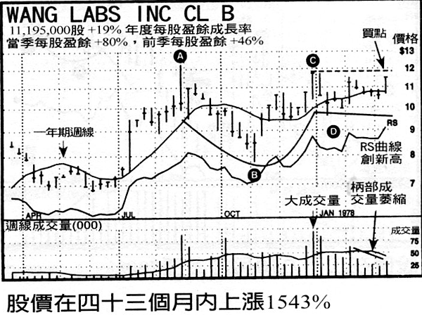
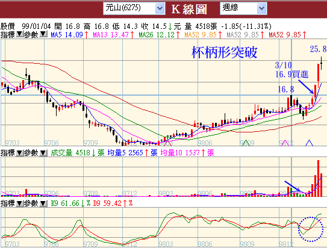
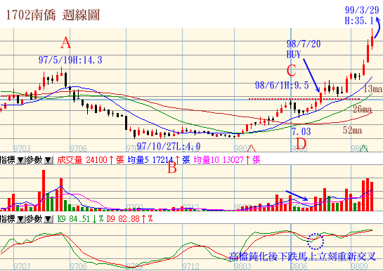
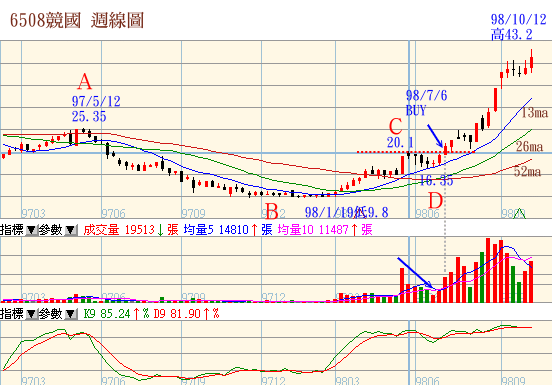

## 帶柄杯狀排列

　「笑傲股市‧歐尼爾投資致富經典」、「歐尼爾的股市賺錢術」心得整理，最後附幾張臺股範例

　　威廉‧歐尼爾非常注重技術分析，但是他只注重最基本的價格和成交量來研判買賣時機，不使用太複雜的技術指標。他注重的幾個層面，大約是(1)型態(2)成交量(3)相對強度，他只買一年內表現在80以上的股票。

　　歐尼爾的相對強度：目前價格與一年前價格的變動率，然後所有股票拿來排名。100指最強，錢線大亨的52週RS Rank應該就是這個。至於技術型態，他最重視杯柄型、W底與平底(或稱潛伏底)

## **帶柄杯狀排列辨識**

　　最常見的價格型態 ：帶柄杯狀排列屬於最重要的價格型態之一，整個價格排列的形狀，就像咖啡杯的側面圖。

圖一、帶柄杯狀排列示意圖

 

■ 杯狀排列的發展時間，可能長達七週，甚至六十五週，但最正常情況都在三到六個月之間。

■ 由排列左側杯緣最高點起算，最深回檔程度 (杯底)(即圖一之A-B)可能在12%到15%左右，但也可能回檔33%。

■ 潛力強勁的杯狀排列，排列發生之前，必須有非常明確的上升趨勢，價格漲幅至少要有30%，相對強度也要明顯轉強，成交量更要配合放大。(圖一之X-A)

■ 杯狀排列的底部形狀，大多(但不是全部)呈現U型圓弧狀，而不是相對尖銳的V型。這種結構使得最低點附近，經常呈現2、3波突兀的小賣壓。這種U型結構很重要，因為可以清洗掉一些浮額，讓缺乏耐心或勇氣的投資人殺出持股。所以當價格向上突破之後，漲勢初期急著想獲利了結的人不多。

　　當大盤作中期回檔時，成長股經常出現杯狀排列，其回檔幅度可能是大盤的一‧五倍到二．五倍之間。對於這類股票，通常應該挑選回檔幅度較小的對象。不論處在多頭或空頭市場，如果個股的回檔程度超過大盤約二‧五倍，其結構可能就太鬆散，不甚可靠。舉例來說，2000年第二季與第三季左右，包括JDS Uniphase在內的很多高科技股票，其杯狀排列的結構就太鬆散。這類的排列非常不可靠，即使型態看起來即將完成而價格向上突破，也應該儘量避免買進。

　　多頭行情之下，某些價格波動特別劇烈的個股，其杯狀排列的回檔幅度可能高達40%或50%。如果在多頭行情之下，回檔幅度還如此深，這類底部排列就值得懷疑，即使價格試圖向上突破也一樣。理由何在？如果由排列高點到低點之間的回檔高達50%，則由低點起算的走勢必須上漲100%才能回到先前高點。歷史資料顯示，這類股票的漲勢在向上突破之後，繼續延伸5%到15%就會大幅回檔。而且這類股票由杯底直接回升向上突破，成功的案例相對少見，風險偏高。

　　海洋貨櫃 (SeaContainers)是一個罕見的例外，其股價在1975年多頭市場的中期回檔過程內，價格下跌大約50%。

　　股價回檔整理過程，形成結構非常完整的帶柄杯狀排列，股價在隨後一百零一週內上漲554%。1975年6月初，我到波士頓的富達研究管理公司做簡報提到這支股票，當時其盈餘成長為54%，最近一季盈餘成長率為192%，而且呈現典型的杯狀排列。看到這些數據之後，基金經理人的興趣大增。

　　由這些案例可以發現，在多頭市場中期回檔或空頭行情發展過程內，杯狀排列的回檔幅度可能高達50%或60%，結果還是成功向上突破 (請參考上述兩個走勢圖)。回檔幅度之所以這麼深，主要是受到大盤影響，而且個股先前的漲勢也太過於兇猛。

 

## **杯柄的基本性質**

　　通常杯柄排列需要一、兩個星期的發展，整個趨勢稍微朝下，末期還經常出現洗盤 (杯柄的最低價往往出現在後期)。杯柄向下發展的期間，有明顯價跌量縮的跡象。

　　沒有杯柄的杯狀排列，通常失敗率較高，但也有一些著名的成功案例。另外，1999年期間，有些股價波動劇烈的科技股，其柄狀排列只花一、兩個星期發展，按著就展開猛烈的漲勢。

　　如果杯柄出現，必須發生在杯狀高度的上半部，也就是說杯柄必須位在杯狀絕對高點與絕對低點之間的上半部。另外，杯柄也必須位在兩百天移動平均之上。如果杯柄位在杯狀的下半部，或位在兩百天均線之下，這類排列的失敗率較高。換言之，截至當時為止的股票需求程度不夠強，不能有效推升股價。

　　另外，杯柄如果朝上發展 (線形低點慢慢墊高，或呈現橫向發展而完全沒有下壓跡象)，這類杯狀排列一旦向上突破之後，失敗的頻率反而較高。朝上發展的杯柄，缺乏洗盤作用，因為股價由杯底上揚到杯□右緣，隨後並沒有出現明顯的回檔整理。這種高風險現象經常發生在第三或第四階段底部，或落後股的底部，或是過份明顯而追隨者太多的領導股。總之，對於這種杯柄上翹的杯狀排列，務必要小心。

　　杯柄發展過程中，由杯狀絕對高點起算的股價回檔程度應該保持在8%~12%(舊版為10%到15%)之間， 除非是很大型的杯狀排列(稍早提到的海洋貨櫃就是顯著的例外)。處在多頭市場之下，如果杯柄的回檔程度過大，恐怕就不太恰當，風險也提高。可是如果杯狀排列發生在空頭市場即將結束時，杯柄可能受到大盤暴跌的影響而急挫20-30% 這也是很正常的現象。

## **潛力股價格型態結構應該緊密**

　　值得買進的股票其價格型態內應該有一些結構緊密之處。就週線圖來說，所謂結構緊密是指單一線形很短 (高、低價差很小)，而且連續幾週的收盤價罕有變動。如果底部型態內的每支線形都很長，結構就太過於鬆散，即使向上突破，漲勢非常有限。可是或許業餘分析者不能區分這方面的差別，底部型態結構鬆散的股票，價格也可能上漲5%到15%，然後行情就結束了。

## **尋找樞紐點 ，觀察 「成交量變動百分率」**

　　股票完成適當的帶柄杯狀排列，然後向上突破，這也是傑西．李佛摩所說的 「樞紐點」或 「最小阻力線」，當天成交量至少應該較平常增加50%。對於一些新的領導股，主要突破過程爆出500%到1000%的成交量也非不尋常。多數情況下，樞紐突破過程的買盤主要是專業玩家。一般投資大眾通常不敢在這個時候進場，因為沒有道理在最高價買進，整個情況看起來很危險。請注意，股票投資者不需要在最低價或其附近買進。而是要在成功機會最高的適當時機買進。換言之，你必須在場外觀察，耐心等候，直到股價向上突破而出現買點，這時才進場。如果你必須工作，無法隨時觀察行情變化，不妨利用網路或手機的小型報價工具，如此應該可以幫助你掌握向上突破的買點。

　　精明投資人會等待，然後在樞紐買點進場，因為這才是行情正式啟動的位置。在樞紐買點出現之前進場，時機可能太早；很多情況下，底部型態始終沒有完成 (價格沒有向上突破)，結果股價不上不下卡在狹幅區間內，甚至下跌。實際買進之前，你需要股票展現其力量。反之，如果股價已經上漲超過樞紐買點的5%到10%，這時進場又稍嫌太遲，很可能在下波修正走勢中被迫停損出場。換言之，如果太遲進場，往往不能讓股價保持足夠的活動空間，正常的修正走勢也可能引發8%停損。

　　帶柄杯狀排列的樞紐買點，未必是該型態內的最高價。多數情況下，樞紐買點大約在最高價之下的5%至10%位置。樞紐買點通常是柄部的最高價，但柄部最高價往往不是整個排列的最高價 (後者通常發生在杯口左緣)。務必要留意這點。如果你等到價格突破整個排列的最高價，時機恐怕已經太晚。如果沿著整個排列 (包括柄部)的幾個最高價繪製下降趨勢線，然後把買點設定在下降趨勢線的突破位置，這往往可以讓你提早進場。可是前提是你必須具備足夠的技術分析知識，並且做出正確的判斷。

## **底部型態低點的成交量呈現萎縮**

　　結構完整的底部排列，杯狀最低點的一、兩個星期與柄部最低點附近，通常成交量都有明顯萎縮的現象。換言之，在這些低價區，賣壓已經不重。這是承接階段的正常現象，至少對於強勢股而言是如此。總之，線形緊密 (日線或週線的收盤價緊靠在一起)，成交量萎縮，兩者都是好現象。

## **大成交量線索**

　　對於有訓練的技術分析者來說，另一個重要線索，是日線圖或週線圖上的成交量突兀變化。微軟就是一個典型的案例，請參考下列走勢圖。

　　幾個星期的大成交量上漲行情，隨後出現價跌量縮走勢，通常這也是好現象。如果同時採用日線圖與週線圖，往往曾發現一些不尋常的活動只出現在一天之內。成交量是一個非常值得研究的指標，可以協助你辨識股票究竟是處在承接 (機構買進)或出貨(機構賣出)階段。一旦具備這方面的知識，就不需仰賴一些投資專家的個人意見。關鍵走勢往往必須有大成交量配合。

　　成交量是衡量供需狀況與機構贊助程度的最可靠工具。學習如何運用股價走勢圖拿捏精準的買點。買進時機不對，往往要付出嚴重代價。

　　下一次當你要買進股票時，請查核週線成交量。在底部發展階段內，週線收盤價上漲而成交量大於平均水準的線形支數，應該要超過過線收盤價下跌而呈現平均成交量的線形支數。

## **範例**

以下是一些杯柄型的型態。

 

 

 

 

 
